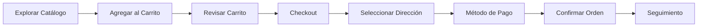

# 🐱 Catbox - E-commerce de Coleccionables

<div align="center">


**Tienda online especializada en coleccionables de anime, K-pop y merchandising**

[Características](#características) • [Instalación](#instalación) • [Uso](#uso) • [Tecnologías](#tecnologías) • [Estructura](#estructura)

</div>

---

## 📋 Tabla de Contenidos

- [Descripción](#descripción)
- [Características Principales](#características-principales)
- [Requisitos del Sistema](#requisitos-del-sistema)
- [Instalación](#instalación)
- [Configuración](#configuración)
- [Uso](#uso)
- [Módulos del Sistema](#módulos-del-sistema)
- [Estructura del Proyecto](#estructura-del-proyecto)
- [Base de Datos](#base-de-datos)
- [Credenciales de Prueba](#credenciales-de-prueba)
- [Tecnologías Utilizadas](#tecnologías-utilizadas)
- [Screenshots](#screenshots)
- [Contribución](#contribución)
- [Licencia](#licencia)

---

## 📝 Descripción

**Catbox** es una plataforma e-commerce completa desarrollada con Laravel 11, especializada en la venta de productos coleccionables como Nendoroids, photocards de K-pop, llaveros y merchandising de anime. El sistema incluye gestión completa de inventario, procesamiento de órdenes, sistema de carrito de compras, y un panel administrativo robusto con estadísticas detalladas.

### 🎯 Objetivo del Proyecto

Proporcionar una experiencia de compra fluida y moderna para coleccionistas, con un sistema de administración potente que permite gestionar productos, categorías, órdenes y generar reportes detallados de ventas.

---

## ✨ Características Principales

### 👥 Para Usuarios

- ✅ **Catálogo de Productos Completo**
  - Sistema de búsqueda avanzada
  - Filtrado por categorías, precio y disponibilidad
  - Vista detallada con galería de imágenes
  - Productos relacionados y recomendaciones

- 🛒 **Carrito de Compras Inteligente**
  - Actualización dinámica de cantidades
  - Validación automática de stock
  - Cálculo en tiempo real de totales
  - Persistencia de sesión

- 📦 **Gestión de Órdenes**
  - Seguimiento de estado en tiempo real (pendiente, procesando, enviado, entregado)
  - Múltiples métodos de pago (tarjeta, PayPal)
  - Gestión de direcciones de entrega
  - Notas personalizadas por orden
  - Historial completo de compras

- 🏠 **Panel de Usuario**
  - Dashboard personalizado con estadísticas
  - Gestión de direcciones de entrega
  - Historial de órdenes
  - Información de perfil

### 🔐 Para Administradores

- 📊 **Dashboard Administrativo**
  - Métricas en tiempo real
  - KPIs principales (ventas, órdenes, usuarios, productos)
  - Vista rápida de órdenes pendientes y stock bajo
  - Top 5 productos más vendidos

- 📦 **Gestión de Productos**
  - CRUD completo de productos
  - Sistema multi-imagen con imagen principal
  - Gestión de stock e inventario
  - Activación/desactivación de productos
  - Filtros avanzados y búsqueda

- 🏷️ **Gestión de Categorías**
  - CRUD de categorías
  - Generación automática de vistas personalizadas
  - Slugs únicos para URLs amigables
  - Conteo de productos por categoría

- 📋 **Gestión de Órdenes**
  - Vista completa de todas las órdenes
  - Actualización de estados
  - Filtrado por cliente, fecha y estado
  - Detalles completos de cada orden
  - Información de pago y entrega

- 📈 **Sistema de Estadísticas Avanzado**
  - **Dashboard General**: Métricas consolidadas, comparación de períodos, gráficos interactivos
  - **Análisis de Ventas**: Ventas por día/hora/categoría, tendencias y patrones
  - **Análisis de Productos**: Top productos, stock bajo, productos sin ventas, rendimiento por categoría
  - **Análisis de Clientes**: Top clientes, clientes nuevos, segmentación, análisis de compra

### 🎨 Características Técnicas

- **Arquitectura MVC**: Código bien organizado y mantenible
- **Responsive Design**: Interfaz adaptable a todos los dispositivos
- **SEO Friendly**: URLs amigables con slugs
- **Imágenes Optimizadas**: Sistema de fallback para imágenes faltantes
- **Validación Robusta**: Validaciones del lado del servidor y cliente
- **Sistema de Helpers**: Funciones auxiliares reutilizables
- **Middleware Personalizado**: Control de acceso basado en roles
- **Seeders Incluidos**: Datos de prueba para desarrollo rápido

---

## 💻 Requisitos del Sistema

### Requisitos Mínimos

- **PHP** >= 8.2
- **Composer** >= 2.x
- **Node.js** >= 18.x (para assets)
- **MySQL** >= 8.0 o **PostgreSQL** >= 13
- **Servidor Web**: Apache 2.4+ o Nginx 1.18+

### Extensiones PHP Requeridas

```bash
php-mbstring
php-xml
php-curl
php-zip
php-gd (para manipulación de imágenes)
php-mysql o php-pgsql
php-intl
```

---

## 🚀 Instalación

### 1. Clonar el Repositorio

```bash
git clone https://github.com/tu-usuario/catbox.git
cd catbox
```

### 2. Instalar Dependencias

```bash
# Dependencias de PHP
composer install

# Dependencias de Node.js (opcional, si usas compilación de assets)
npm install
```

### 3. Configurar Variables de Entorno

```bash
# Copiar archivo de ejemplo
cp .env.example .env

# Generar key de aplicación
php artisan key:generate
```

### 4. Configurar Base de Datos

Edita el archivo `.env` con tus credenciales:

```env
DB_CONNECTION=mysql
DB_HOST=127.0.0.1
DB_PORT=3306
DB_DATABASE=catbox
DB_USERNAME=tu_usuario
DB_PASSWORD=tu_contraseña
```

### 5. Ejecutar Migraciones

```bash
# Crear todas las tablas
php artisan migrate

# (Opcional) Cargar datos de prueba
php artisan db:seed
```

### 6. Crear Storage Link

```bash
php artisan storage:link
```

### 7. Compilar Assets (Opcional)

```bash
# Desarrollo
npm run dev

# Producción
npm run build
```

### 8. Iniciar Servidor

```bash
php artisan serve
```

Visita: `http://localhost:8000`

---

## ⚙️ Configuración

### Configuración de Correo (Opcional)

Para notificaciones por email, configura en `.env`:

```env
MAIL_MAILER=smtp
MAIL_HOST=smtp.mailtrap.io
MAIL_PORT=2525
MAIL_USERNAME=tu_username
MAIL_PASSWORD=tu_password
MAIL_ENCRYPTION=tls
MAIL_FROM_ADDRESS=noreply@catbox.com
MAIL_FROM_NAME="Catbox"
```

### Configuración de Imágenes

El sistema usa `storage/app/public` para almacenar imágenes. Asegúrate de que:

1. El link simbólico esté creado: `php artisan storage:link`
2. Los permisos sean correctos:
   ```bash
   chmod -R 775 storage
   chmod -R 775 bootstrap/cache
   ```

### Datos de Prueba

Después de ejecutar los seeders, tendrás:

- **Categorías**: Nendoroid, Photocards, Llaveros
- **Productos**: Varios productos de ejemplo en cada categoría
- **Usuarios**: Ver sección [Credenciales de Prueba](#credenciales-de-prueba)

---

## 🎮 Uso

### Acceso al Sistema

#### Usuario Normal
1. Registrarse en `/register` o iniciar sesión en `/login`
2. Explorar productos en `/productos`
3. Agregar productos al carrito
4. Proceder al checkout
5. Gestionar órdenes desde el dashboard de usuario

#### Administrador
1. Iniciar sesión con credenciales de admin
2. Acceder al panel administrativo desde el navbar
3. Gestionar productos, categorías y órdenes
4. Consultar estadísticas detalladas

### Flujo de Compra



---

## 📦 Módulos del Sistema

### 1. **Módulo de Autenticación**
- Registro de usuarios
- Login/Logout
- Recuperación de contraseña
- Sistema de roles (Usuario/Admin)

### 2. **Módulo de Productos**
- Catálogo público
- Sistema de búsqueda y filtros
- Vista detallada con galería
- Productos relacionados
- Gestión de stock

### 3. **Módulo de Carrito**
- Agregar/Quitar productos
- Actualizar cantidades
- Cálculo automático de totales
- Validación de stock

### 4. **Módulo de Órdenes**
- Creación de órdenes
- Proceso de checkout
- Múltiples métodos de pago
- Seguimiento de estado
- Historial completo

### 5. **Módulo de Direcciones**
- Gestión de direcciones de entrega
- Dirección principal
- CRUD completo

### 6. **Módulo Administrativo**
- Dashboard con KPIs
- Gestión de productos
- Gestión de categorías
- Gestión de órdenes
- Sistema de estadísticas

### 7. **Módulo de Estadísticas**
- Dashboard general
- Análisis de ventas
- Análisis de productos
- Análisis de clientes
- Gráficos interactivos con Chart.js

---

## 📁 Estructura del Proyecto

```
catbox/
├── app/
│   ├── Helpers/              # Funciones auxiliares
│   │   └── ImagenHelper.php  # Helper para manejo de imágenes
│   ├── Http/
│   │   ├── Controllers/
│   │   │   ├── Admin/        # Controladores administrativos
│   │   │   │   ├── AdminController.php
│   │   │   │   ├── ProductoAdminController.php
│   │   │   │   ├── CategoriaAdminController.php
│   │   │   │   ├── OrdenAdminController.php
│   │   │   │   └── EstadisticaController.php
│   │   │   ├── Auth/         # Controladores de autenticación
│   │   │   ├── CarritoController.php
│   │   │   ├── OrdenController.php
│   │   │   ├── ProductoController.php
│   │   │   ├── DireccionController.php
│   │   │   └── HomeController.php
│   │   └── Middleware/
│   │       └── AdminMiddleware.php  # Middleware de autorización
│   ├── Models/               # Modelos Eloquent
│   │   ├── User.php
│   │   ├── Producto.php
│   │   ├── CategoriaProducto.php
│   │   ├── ImagenProducto.php
│   │   ├── Carrito.php
│   │   ├── ItemCarrito.php
│   │   ├── Orden.php
│   │   ├── DetalleOrden.php
│   │   ├── Pago.php
│   │   ├── DireccionEntrega.php
│   │   └── Estadistica.php
│   └── Providers/
│       └── AppServiceProvider.php
├── database/
│   ├── migrations/           # Migraciones de base de datos
│   └── seeders/              # Datos de prueba
│       ├── UserSeeder.php
│       ├── CategoriaProductoSeeder.php
│       └── ProductoSeeder.php
├── public/
│   ├── img/                  # Imágenes públicas
│   │   └── NoImagen.jpg      # Imagen placeholder
│   └── storage/              # Link simbólico a storage
├── resources/
│   └── views/
│       ├── admin/            # Vistas administrativas
│       │   ├── dashboard.blade.php
│       │   ├── productos/
│       │   ├── categorias/
│       │   ├── ordenes/
│       │   └── estadisticas/
│       ├── auth/             # Vistas de autenticación
│       ├── carrito/          # Vistas del carrito
│       ├── ordenes/          # Vistas de órdenes
│       ├── productos/        # Vistas de productos
│       │   ├── index.blade.php
│       │   ├── show.blade.php
│       │   ├── buscar.blade.php
│       │   └── categorias/   # Vistas por categoría
│       ├── usuario/          # Dashboard de usuario
│       ├── layouts/
│       │   └── app.blade.php # Layout principal
│       └── landing.blade.php # Página de inicio
├── routes/
│   ├── web.php               # Rutas web
│   └── console.php
├── storage/
│   └── app/
│       └── public/           # Almacenamiento de imágenes
│           └── productos/
├── .env.example              # Ejemplo de variables de entorno
├── composer.json             # Dependencias PHP
├── package.json              # Dependencias Node.js
└── README.md                 # Este archivo
```

---

## 🗄️ Base de Datos

### Diagrama de Relaciones

```
users (usuarios)
  ├── carritos (1:1)
  ├── ordenes (1:N)
  └── direcciones_entrega (1:N)

categorias_producto
  └── productos (1:N)

productos
  ├── imagenes_producto (1:N)
  ├── items_carrito (1:N)
  ├── detalles_orden (1:N)
  └── estadisticas (1:N)

carritos
  └── items_carrito (1:N)

ordenes
  ├── detalles_orden (1:N)
  ├── pagos (1:1)
  └── direccion_entrega (N:1)
```

### Tablas Principales

1. **users** - Usuarios del sistema
2. **productos** - Catálogo de productos
3. **categorias_producto** - Categorías de productos
4. **imagenes_producto** - Imágenes de productos
5. **carritos** - Carritos de compra
6. **items_carrito** - Items en el carrito
7. **ordenes** - Órdenes de compra
8. **detalles_orden** - Detalles de cada orden
9. **pagos** - Información de pagos
10. **direcciones_entrega** - Direcciones de entrega
11. **estadisticas** - Datos para reportes

### Migraciones

```bash
# Ver estado de migraciones
php artisan migrate:status

# Ejecutar migraciones pendientes
php artisan migrate

# Rollback última migración
php artisan migrate:rollback

# Refrescar base de datos (cuidado en producción)
php artisan migrate:fresh --seed
```

---

## 🔐 Credenciales de Prueba

### Administrador

```
Email: admin@catbox.com
Contraseña: admin123
```

### Usuario Normal

```
Email: usuario@catbox.com
Contraseña: usuario123
```

> ⚠️ **Importante**: Cambia estas credenciales en producción ejecutando:
> ```bash
> php artisan db:seed --class=UserSeeder
> ```
> Y luego actualiza las contraseñas desde la base de datos.

---

## 🛠️ Tecnologías Utilizadas

### Backend

-  **Laravel 11** - Framework PHP
-  **PHP 8.2+** - Lenguaje de programación
-  **MySQL** - Base de datos relacional
-  **Eloquent ORM** - Mapeo objeto-relacional

### Frontend

-  **Bootstrap 5.3** - Framework CSS
-  **Bootstrap Icons** - Iconografía
-  **Chart.js** - Gráficos interactivos
-  **JavaScript ES6+** - Interactividad
- **Blade Templates** - Motor de plantillas de Laravel

### Herramientas de Desarrollo

-  **Composer** - Gestor de dependencias PHP
-  **NPM** - Gestor de paquetes JavaScript
-  **Git** - Control de versiones

### Arquitectura y Patrones

- **MVC** (Model-View-Controller)
- **Repository Pattern** (para estadísticas complejas)
- **Service Layer** (lógica de negocio)
- **Middleware** (autenticación y autorización)
- **Helpers** (funciones auxiliares reutilizables)

